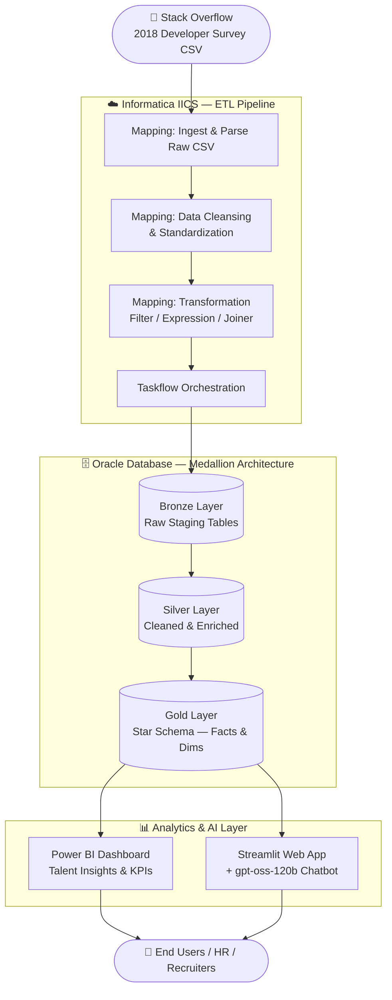

# StackPulse 🚀
### Developer Talent Intelligence Platform

> An end-to-end data engineering pipeline that transforms the Stack Overflow 2018 Developer Survey into actionable talent insights — powered by Informatica IICS, Oracle, Power BI, and an AI chatbot.

---

## 📌 Overview

StackPulse ingests, transforms, and analyzes developer survey data to help organizations understand global developer talent trends — including technology adoption, salary benchmarks, skill demand, and workforce demographics. It combines a robust ETL pipeline with an interactive BI dashboard and a conversational AI layer for natural language querying.

---

## 🏗️ Architecture



---

## 🧱 Tech Stack

| Layer | Tool / Technology |
|---|---|
| Data Source | Stack Overflow Developer Survey 2018 |
| ETL & Orchestration | Informatica IICS (IDMC) |
| Data Warehouse | Oracle Database |
| Data Modeling | Star Schema (Fact + Dimension Tables) |
| BI & Visualization | Microsoft Power BI |
| Web Application | Streamlit (Python) |
| AI Chatbot | GPT-o3 (gpt-oss-120b) |
| Scripting | PL/SQL, Python |

---

## 📂 Project Structure

```
StackPulse/
│
├── data/
│   └── survey_results_2018.csv        # Raw Stack Overflow survey data
│
├── etl/
│   ├── mappings/                      # Informatica IICS mapping exports
│   ├── taskflows/                     # Orchestration taskflow configs
│   └── sql/
│       ├── bronze_ddl.sql             # Staging table definitions
│       ├── silver_transforms.sql      # Cleansing & enrichment logic
│       └── gold_star_schema.sql       # Fact & dimension table DDLs
│
├── powerbi/
│   └── StackPulse_Dashboard.pbix      # Power BI report file
│
├── streamlit/
│   └── app.py                         # Streamlit application entry point with GPT-o3 (gpt-oss-120b) chatbot integration                                      
│
├── pyproject.toml
│
└── README.md
```

---

## 🔄 Pipeline — Medallion Architecture

### 🥉 Bronze Layer — Raw Ingestion
- Raw CSV ingested as-is into Oracle staging tables via Informatica IICS flat file connector
- No transformation; preserves source fidelity

### 🥈 Silver Layer — Cleansing & Standardization
- Null handling, data type casting, deduplication
- Standardization of country names, salary fields, and employment types
- Applied via IICS Expression and Filter transformations

### 🥇 Gold Layer — Star Schema
- **Fact Table:** `FACT_DEVELOPER_SURVEY` — core survey responses with foreign keys
- **Dimensions:** `DIM_DEVELOPER`, `DIM_TECHNOLOGY`, `DIM_COUNTRY`, `DIM_JOB_ROLE`, `DIM_EDUCATION`
- Surrogate key generation via IICS Sequence Generator

---

## 📊 Power BI Dashboard — Key Insights

- 🌍 **Global Developer Map** — country-wise developer distribution
- 💰 **Salary Benchmarks** — by experience, role, and country
- 🛠️ **Top Technologies** — most-used languages, frameworks, and tools
- 📈 **Hiring Signals** — job satisfaction, remote work trends, employment type
- 🎓 **Education vs. Salary** — degree type correlation with compensation

---

## 🤖 AI Chatbot — GPT-o3 (gpt-oss-120b)

The Streamlit app includes a natural language chatbot powered by **GPT-o3 (gpt-oss-120b)**, enabling users to ask questions like:

> *"Which countries pay the highest salaries for Python developers?"*
> *"What's the most common tech stack among full-stack developers?"*
> *"Show me trends in remote work adoption across different job roles."*

The chatbot uses pre-aggregated Gold layer data as context to generate accurate, grounded responses.

---

## 🚀 Getting Started

### Prerequisites
- Oracle Database (21c or above)
- Informatica IICS account with active org
- Power BI Desktop
- Python 3.9+
- OpenAI-compatible API Key for gpt-oss-120b

### Run the Streamlit App

```bash
# Clone the repo
git clone https://github.com/your-username/StackPulse.git
cd StackPulse/app

# Install dependencies
pip install -r requirements.txt

# Set your API key
export OPENAI_API_KEY=your_key_here

# Launch the app
streamlit run app.py
```

---

## 📈 Dataset

- **Source:** [Stack Overflow Annual Developer Survey 2018](https://insights.stackoverflow.com/survey)
- **Records:** ~100,000 developer responses
- **Fields:** 129 columns covering demographics, tools, salary, job satisfaction, and more
